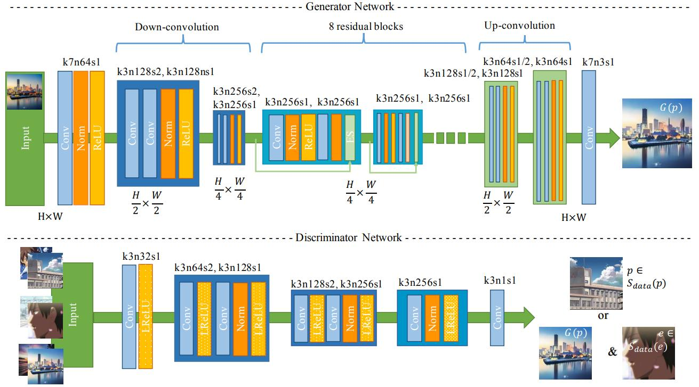
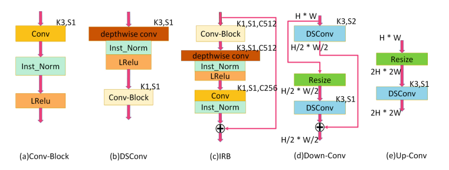
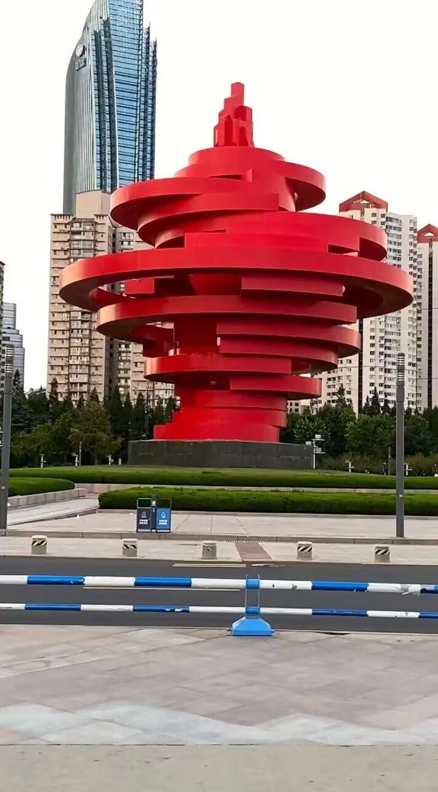
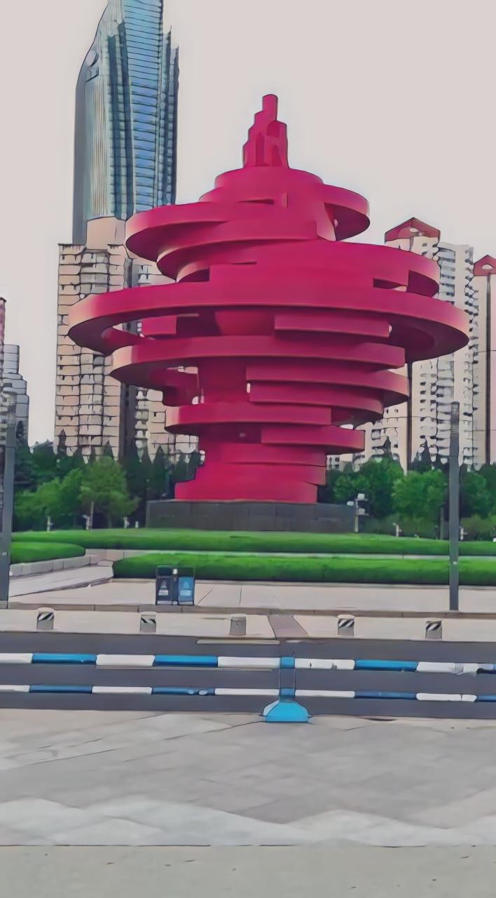
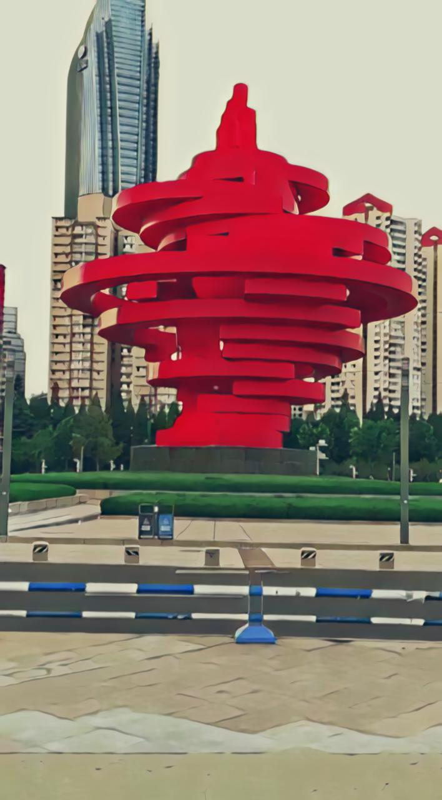
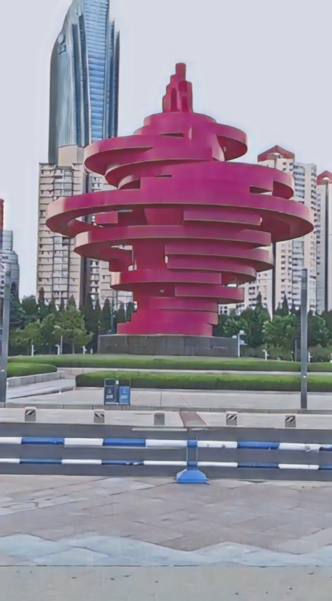
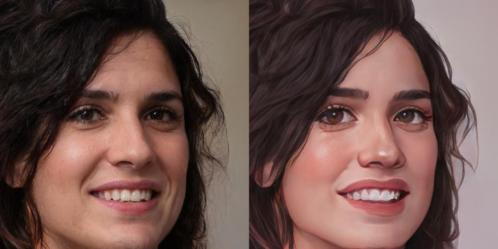
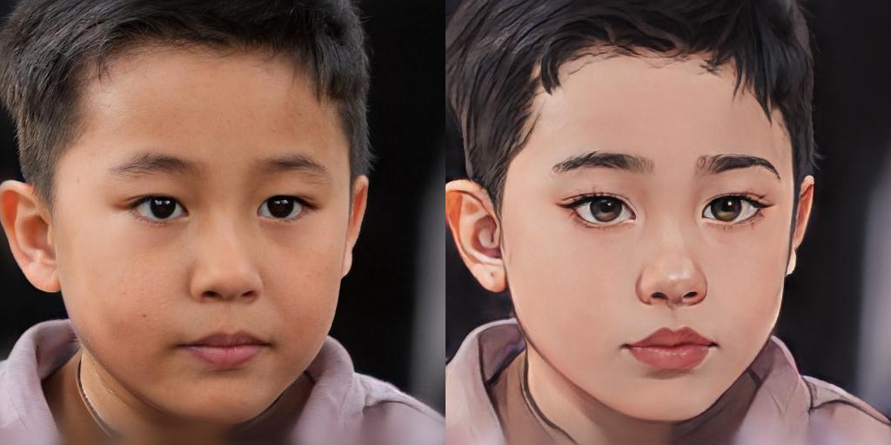
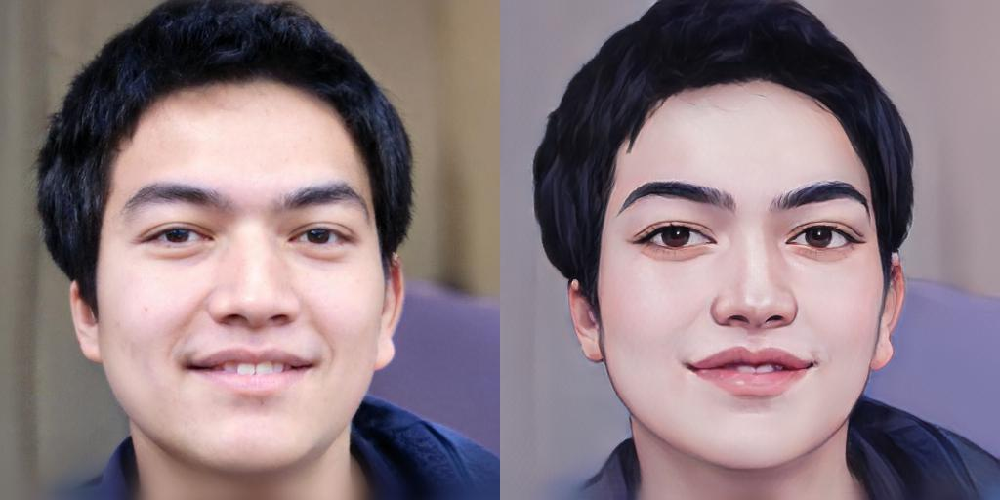

<h2> 项目报告</h2>
[toc]

### 一、Introduction 

#### 1. GAN

 &nbsp;&nbsp; &nbsp;&nbsp; &nbsp;&nbsp;生成对抗网络（GAN）是一种深度学习模型，由生成器（Generator）和判别器（Discriminator）两个部分组成。GAN的目标是通过对抗训练的方式，让生成器生成的样本与真实样本无法被判别器区分出来，从而生成逼真的数据样本。
生成器是一个神经网络模型，它接收一个随机噪声向量作为输入，并输出一个与真实样本相似的数据样本。生成器的目标是尽可能地生成逼真的样本，以欺骗判别器。

&nbsp;&nbsp; &nbsp;&nbsp; &nbsp;&nbsp;当模型都是多层感知器时，对抗建模框架最容易应用。要了解发生器在数据 $x$ 上的的分布 $p_g$ ，我们在输入噪声变量 $z$ 上定义一个先验概率 $p_z(z)$ ，然后将到数据空间的映射表示为 $G(z;\theta_g)$ ，其中 $G$ 是一个微分函数，由具有参数 $\theta_g$ 的多层感知器表示。我们还定义了第二个多层感知器 $D(x;\theta_d)$ ，它输出一个标量。 $D(x)$ 表示 $x$ 来自数据而非 $p_g$ 的概率。我们训练 $D$ 来最大化为 $G$ 训练样本和样本分配正确标签的可能性。我们同时训练 $G$ 来最小化。换句话说， $D$ 和 $G$ 玩以下具有价值函数^[1] $V(G,D)$ 的两人最大最小博弈，价值函数如下:
$$\min_G\max_D V(D,G)=\mathbb{E}_{x\sim p_{data}(x)}[\mathrm{log}D(x)] + \mathbb{E}_{z\sim p_z(z)}[\mathrm{log}(1-D(G(z)))]$$
#### 2. cartoonGAN

&nbsp;&nbsp; &nbsp;&nbsp; &nbsp;&nbsp;CartoonGAN是一种基于生成对抗网络（GAN）的图像风格转换模型，旨在将真实照片转换为卡通风格的图像。它是由李飞飞等人于2018年提出的。

&nbsp;&nbsp; &nbsp;&nbsp; &nbsp;&nbsp;CartoonGAN的网络结构由生成器和判别器组成，类似于传统的GAN模型。生成器接收真实照片作为输入，并输出对应的卡通风格图像。判别器则负责判断生成器输出的图像是真实照片还是卡通风格图像。

&nbsp;&nbsp; &nbsp;&nbsp; &nbsp;&nbsp;CartoonGAN的训练过程是通过对抗训练来实现的。在每一轮训练中，生成器生成卡通风格的图像，判别器根据真实照片和生成图像进行判别。生成器和判别器通过对抗学习的方式相互调整参数，使得生成的卡通风格图像更加逼真，判别器更加准确。CartoonGAN的优点是能够将真实照片转换为卡通风格的图像，具有广泛的应用前景。
与生成器网络互补的是，判别器网络D用于判断输入图像是否为真实卡通图像。由于判断图像是否为卡通是一项要求较低的任务，而不是常规的全图像判别器，因此我们在D中使用带有较少参数的简单patch级别的判别器。与对象分类不同，卡通风格判别依赖于图像的局部特征。因此，网络D被设计为较浅。在具有平坦层的阶段之后，该网络使用了两个跨步卷积块以降低分辨率并编码分类的基本局部特征。^[2]

下图是CartoonGAN结构图：



#### 3. animeGAN
&nbsp;&nbsp; &nbsp;&nbsp; &nbsp;&nbsp;AnimeGAN 是一个轻量级的生成对抗模型，具有较少的网络参数，并引入了Gram矩阵来生成更生动的风格图像。
为了生成更好的视觉效果的图像，提出了三个损失函数：灰度样式损失(grayscale style loss)、颜色重建损失(color reconstruction loss)和灰度对抗损失(grayscale adversarial loss)。在生成网络中，灰度风格损失和颜色重建损失使生成的图像具有更明显的动漫风格，并保留了照片的颜色。识别网络中的灰度对抗损失使生成的图像具有鲜明的色彩。在鉴别器网络中，我们也使用了 CartoonGAN 提出的促进边缘的对抗损失（edge-promoting adversarial loss）来保留清晰的边缘。^[3]
&nbsp;&nbsp; &nbsp;&nbsp; &nbsp;&nbsp;为了生成高质量的图片，并且稳定训练，我们采用了LSGAN的最小二乘损失函数(least squares loss)作为对抗损失 $L_{adv}(G,D) $。
content loss类似于CartoonGAN:
$$L_{con}(G,D)=E_{p_i\sim S_{data}(p)}[\Vert VGG_l(p_i)-VGG_l(G(p_i)) \Vert_1]$$
&nbsp;&nbsp; &nbsp;&nbsp; &nbsp;&nbsp;grayscale style loss促使网络生成的图像拥有动漫风格的纹理和线条，分别计算生成图像和训练之前得到动漫灰度图片的Gram matrix，然后计算二者的L1 loss：
$$L_{gra}(G,D)=E_{p_i\sim S_{data}(p)},E_{x_i\sim S_{data}(x)}[\Vert Gram(VGG_l(G(p_i)))-Gram(VGG_l(x_i))\Vert_1]$$

color reconstruction loss来让生成图像有原图的色彩。将RGB图转换为YUV，分别计算生成图像和真实图像Y、U、V三个分量的损失：
$$L_{col}(G,D)=E_{p_i\sim S_{data}(p)}[\Vert Y(G(p_i))-Y(p_i)\Vert_1+\Vert U(G(p_i))-U(p_i)\Vert_H+\Vert V(G(p_i))-V(p_i)\Vert_H]$$
整体损失函数为：
$$L(G,D)=\omega_{adv}L_{adv}(G,D)+\omega_{con}L_{con}(G,D)+\omega_{gra}L_{gra}(G,D)+\omega_{col}L_{col}(G,D)$$
生成器的损失函数为：
$$L(G) = w_{adv}E_{p_i \sim S_{data(p)}}[(G(p_i) - 1)^2] + w_{con}L_{con}(G, D) + w_{gra}L_{gra}(G, D) +w_{col}L_{col}(G, D)$$
判别器的损失函数为：
$$L(D)= w_{adv}[E_{a_i\sim S_{data(a)}}[(D(a_i) - 1)^2] + E_{pi\sim S_{data(p)}}[(D(G(p_i)))^2] + E_{x_i\sim S_{data}(x)}[(D(G(p_i)))^2] + 0.1E_{y_i\sim S_{data(y)}}[(D(G(y_i)))^2]]$$


以下是animeGAN的生成器和判别器的网络结构图：


生成器的网络可以看作是编码器-解码器网络。其中主要的模块有标准卷积、深度可分离卷积、残差网络、上采样和下采样模块


### 二、Configuration
#### Requirements
- python >= 3.9.0
- torch >= 1.7.1
- tensorflow compat 1.x 2.x
- opencv
- tqdm
- numpy
- glob
- argparse
- dlib
- pillow
- matplotlib
#### Structure
├─checkpoint            &nbsp;&nbsp; &nbsp;&nbsp; &nbsp;&nbsp;&nbsp;&nbsp; &nbsp;&nbsp; &nbsp;&nbsp;&nbsp;&nbsp; &nbsp;&nbsp; &nbsp;&nbsp;&nbsp;&nbsp; &nbsp;&nbsp; &nbsp;&nbsp;&nbsp;&nbsp; &nbsp;&nbsp; &nbsp;&nbsp;&nbsp;&nbsp; &nbsp;&nbsp; &nbsp;&nbsp;         // 保存模型文件
├─dataset&nbsp;&nbsp; &nbsp;&nbsp; &nbsp;&nbsp;&nbsp;&nbsp; &nbsp;&nbsp; &nbsp;&nbsp;&nbsp;&nbsp; &nbsp;&nbsp; &nbsp;&nbsp;&nbsp;&nbsp; &nbsp;&nbsp; &nbsp;&nbsp;&nbsp;&nbsp; &nbsp;&nbsp; &nbsp;&nbsp;&nbsp;&nbsp; &nbsp;&nbsp; &nbsp;&nbsp;&nbsp;&nbsp; &nbsp;&nbsp; &nbsp;&nbsp;// 训练数据
├─net &nbsp;&nbsp; &nbsp;&nbsp; &nbsp;&nbsp;&nbsp;&nbsp; &nbsp;&nbsp; &nbsp;&nbsp;&nbsp;&nbsp; &nbsp;&nbsp; &nbsp;&nbsp;&nbsp;&nbsp; &nbsp;&nbsp; &nbsp;&nbsp;&nbsp;&nbsp; &nbsp;&nbsp; &nbsp;&nbsp;&nbsp;&nbsp; &nbsp;&nbsp; &nbsp;&nbsp;&nbsp;&nbsp; &nbsp;&nbsp; &nbsp;&nbsp;&nbsp;&nbsp; &nbsp;&nbsp;       // 网络模型
├─res&nbsp;&nbsp; &nbsp;&nbsp; &nbsp;&nbsp;&nbsp;&nbsp; &nbsp;&nbsp; &nbsp;&nbsp;&nbsp;&nbsp; &nbsp;&nbsp; &nbsp;&nbsp;&nbsp;&nbsp; &nbsp;&nbsp; &nbsp;&nbsp;&nbsp;&nbsp; &nbsp;&nbsp; &nbsp;&nbsp;&nbsp;&nbsp; &nbsp;&nbsp; &nbsp;&nbsp;&nbsp;&nbsp; &nbsp;&nbsp; &nbsp;&nbsp;&nbsp;&nbsp; &nbsp;&nbsp; &nbsp;// 资源文件
│  ├─image 
│  └─video
├─tools         nbsp; &nbsp;&nbsp; &nbsp;&nbsp;&nbsp;&nbsp; &nbsp;&nbsp; &nbsp;&nbsp;&nbsp;&nbsp; &nbsp;&nbsp; &nbsp;&nbsp;&nbsp;&nbsp; &nbsp;&nbsp; &nbsp;&nbsp;&nbsp;&nbsp; &nbsp;&nbsp; &nbsp;&nbsp;&nbsp;&nbsp; &nbsp;&nbsp; &nbsp;&nbsp;&nbsp;&nbsp; &nbsp;&nbsp;              // 工具包
│ &nbsp;&nbsp;model.py  nbsp; &nbsp;&nbsp; &nbsp;&nbsp;&nbsp;&nbsp; &nbsp;&nbsp; &nbsp;&nbsp;&nbsp;&nbsp; &nbsp;&nbsp; &nbsp;&nbsp;&nbsp;&nbsp; &nbsp;&nbsp; &nbsp;&nbsp;&nbsp;&nbsp; &nbsp;&nbsp; &nbsp;&nbsp;&nbsp;&nbsp; &nbsp;&nbsp;       // animeGAN模型
│ &nbsp;&nbsp;train.py     nbsp; &nbsp;&nbsp; &nbsp;&nbsp;&nbsp;&nbsp; &nbsp;&nbsp; &nbsp;&nbsp;&nbsp;&nbsp; &nbsp;&nbsp; &nbsp;&nbsp;&nbsp;&nbsp; &nbsp;&nbsp; &nbsp;&nbsp;&nbsp;&nbsp; &nbsp;&nbsp; &nbsp;&nbsp;&nbsp;&nbsp; &nbsp;&nbsp; &nbsp;&nbsp;      // 模型训练
│ &nbsp;&nbsp;test.pynbsp; &nbsp;&nbsp; &nbsp;&nbsp;&nbsp;&nbsp; &nbsp;&nbsp; &nbsp;&nbsp;&nbsp;&nbsp; &nbsp;&nbsp; &nbsp;&nbsp;&nbsp;&nbsp; &nbsp;&nbsp; &nbsp;&nbsp;&nbsp;&nbsp; &nbsp;&nbsp; &nbsp;&nbsp;&nbsp;&nbsp; &nbsp;&nbsp; &nbsp;&nbsp;&nbsp;&nbsp; &nbsp;// 模型测试
│ &nbsp;&nbsp;video_stylized.pynbsp; &nbsp;&nbsp; &nbsp;&nbsp;&nbsp;&nbsp; &nbsp;&nbsp; &nbsp;&nbsp;&nbsp;&nbsp; &nbsp;&nbsp; &nbsp;&nbsp;&nbsp;&nbsp; &nbsp;&nbsp; &nbsp;&nbsp;&nbsp;&nbsp;&nbsp;&nbsp;// 视频动漫化
│ &nbsp;&nbsp;face_stylized.ipynbnbsp; &nbsp;&nbsp; &nbsp;&nbsp;&nbsp;&nbsp; &nbsp;&nbsp; &nbsp;&nbsp;&nbsp;&nbsp; &nbsp;&nbsp; &nbsp;&nbsp;&nbsp;&nbsp; &nbsp;&nbsp; &nbsp;&nbsp;&nbsp;// 人脸动漫化
└─  shape_predictor_68_face_landmarks.dat &nbsp; &nbsp;//人脸特征提取数据库

### 三、Process and Results
#### Model construction
**1.生成器和判别器**
&nbsp;&nbsp; &nbsp;&nbsp;&nbsp;生成器网络是一个编码器-解码器的结构，其中除了标准卷积外，有深度可分离卷积，倒置残差网络，上采样和下采样模块。
<details><summary>深度可分离卷积</summary>

```python
def dwise_conv(input, k_h=3, k_w=3, channel_multiplier=1, strides=[1, 1, 1, 1],
               padding='VALID', name='dwise_conv', bias=True):
    input = tf.pad(input, [[0, 0], [1, 1], [1, 1], [0, 0]], mode="REFLECT")
    with tf.variable_scope(name):
        in_channel = input.get_shape().as_list()[-1]
        w = tf.get_variable('w', [k_h, k_w, in_channel, channel_multiplier],
                            regularizer=None, initializer=tf_layers.variance_scaling_initializer())
        conv = tf.nn.depthwise_conv2d(
            input, w, strides, padding, rate=None, name=name, data_format=None)
        if bias:
            biases = tf.get_variable(
                'bias', [in_channel * channel_multiplier], initializer=tf.constant_initializer(0.0))
            conv = tf.nn.bias_add(conv, biases)
        return conv
```
</details>

<details><summary>倒置残差网络</summary>

```python
    def InvertedRes_block(self, input, expansion_ratio, output_dim, stride, name, reuse=False, bias=None):
        with tf.variable_scope(name, reuse=reuse):
            # pw
            bottleneck_dim = round(
                expansion_ratio * input.get_shape().as_list()[-1])
            net = Conv2DNormLReLU(input, bottleneck_dim,
                                  kernel_size=1, Use_bias=bias)

            # dw
            net = dwise_conv(net, name=name)
            net = layer_norm(net, scope='1')
            net = lrelu(net)

            # pw & linear
            net = Conv2D(net, output_dim, kernel_size=1)
            net = layer_norm(net, scope='2')

            # element wise add, only for stride==1
            if (int(input.get_shape().as_list()[-1]) == output_dim) and stride == 1:
                net = input + net

            return net
```
</details>

<details><summary>上采样模块</summary>

```python
def Unsample(inputs, filters, kernel_size=3):
    new_H, new_W = 2 * tf.shape(inputs)[1], 2 * tf.shape(inputs)[2]
    inputs = tf.image.resize_images(inputs, [new_H, new_W])

    return Conv2DNormLReLU(filters=filters, kernel_size=kernel_size, inputs=inputs)
```
</details>

<details><summary>下采样模块</summary>

```python
def Downsample(inputs, filters=256, kernel_size=3):
    new_H, new_W = tf.shape(inputs)[1] // 2, tf.shape(inputs)[2] // 2
    inputs = tf.image.resize_images(inputs, [new_H, new_W])

    return Separable_conv2d(filters=filters, kernel_size=kernel_size, inputs=inputs)
```
</details>

<details><summary>生成器网络结构</summary>

```python
            with tf.variable_scope('A'):
                inputs = Conv2DNormLReLU(inputs, 32, 7)
                inputs = Conv2DNormLReLU(inputs, 64, strides=2)
                inputs = Conv2DNormLReLU(inputs, 64)

            with tf.variable_scope('B'):
                inputs = Conv2DNormLReLU(inputs, 128, strides=2)
                inputs = Conv2DNormLReLU(inputs, 128)

            with tf.variable_scope('C'):
                inputs = Conv2DNormLReLU(inputs, 128)
                inputs = self.InvertedRes_block(inputs, 2, 256, 1, 'r1')
                inputs = self.InvertedRes_block(inputs, 2, 256, 1, 'r2')
                inputs = self.InvertedRes_block(inputs, 2, 256, 1, 'r3')
                inputs = self.InvertedRes_block(inputs, 2, 256, 1, 'r4')
                inputs = Conv2DNormLReLU(inputs, 128)

            with tf.variable_scope('D'):
                inputs = Unsample(inputs, 128)
                inputs = Conv2DNormLReLU(inputs, 128)

            with tf.variable_scope('E'):
                inputs = Unsample(inputs, 64)
                inputs = Conv2DNormLReLU(inputs, 64)
                inputs = Conv2DNormLReLU(inputs, 32, 7)
            with tf.variable_scope('out_layer'):
                out = Conv2D(inputs, filters=3, kernel_size=1, strides=1)
                self.fake = tf.tanh(out)
```
</details>
&nbsp;&nbsp; &nbsp;&nbsp;&nbsp;&nbsp;而判别器只需要对生成器生成的模型进行判别，因此使用传统的CNN网络即可
&nbsp;&nbsp; &nbsp;&nbsp;&nbsp;&nbsp;以上使用的生成器和判别器网络构建位于./net文件夹的generator.py 和 discriminator.py 文件中 

**2.模型搭建**

<details><summary>模型初始化</summary>

```python
    def __init__(self, sess, args):
        self.model_name = 'AnimeGANv2'
        self.sess = sess
        self.checkpoint_dir = args.checkpoint_dir
        self.log_dir = args.log_dir
        self.dataset_name = args.dataset

        self.epoch = args.epoch
        self.init_epoch = args.init_epoch # args.epoch // 20

        self.gan_type = args.gan_type
        self.batch_size = args.batch_size
        self.save_freq = args.save_freq

        self.init_lr = args.init_lr
        self.d_lr = args.d_lr
        self.g_lr = args.g_lr

        """ Weight """
        self.g_adv_weight = args.g_adv_weight
        self.d_adv_weight = args.d_adv_weight
        self.con_weight = args.con_weight
        self.sty_weight = args.sty_weight
        self.color_weight = args.color_weight
        self.tv_weight = args.tv_weight

        self.training_rate = args.training_rate
        self.ld = args.ld

        self.img_size = args.img_size
        self.img_ch = args.img_ch

        """ Discriminator """
        self.n_dis = args.n_dis
        self.ch = args.ch
        self.sn = args.sn

        self.sample_dir = os.path.join(args.sample_dir, self.model_dir)
        check_folder(self.sample_dir)

        self.real = tf.placeholder(tf.float32, [self.batch_size, self.img_size[0], self.img_size[1], self.img_ch], name='real_A')
        self.anime = tf.placeholder(tf.float32, [self.batch_size, self.img_size[0], self.img_size[1], self.img_ch], name='anime_A')
        self.anime_smooth = tf.placeholder(tf.float32, [self.batch_size, self.img_size[0], self.img_size[1], self.img_ch], name='anime_smooth_A')
        self.test_real = tf.placeholder(tf.float32, [1, None, None, self.img_ch], name='test_input')

        self.anime_gray = tf.placeholder(tf.float32, [self.batch_size, self.img_size[0], self.img_size[1], self.img_ch],name='anime_B')


        self.real_image_generator = ImageGenerator('./dataset/train_photo', self.img_size, self.batch_size)
        self.anime_image_generator = ImageGenerator('./dataset/{}'.format(self.dataset_name + '/style'), self.img_size, self.batch_size)
        self.anime_smooth_generator = ImageGenerator('./dataset/{}'.format(self.dataset_name + '/smooth'), self.img_size, self.batch_size)
        self.dataset_num = max(self.real_image_generator.num_images, self.anime_image_generator.num_images)

        self.vgg = Vgg19()
```
</details>
<details><summary>模型创建</summary>

```python
 def build_model(self):
        """ Define Generator, Discriminator """
        self.generated = self.generator(self.real)
        self.test_generated = self.generator(self.test_real, reuse=True)

        anime_logit = self.discriminator(self.anime)
        anime_gray_logit = self.discriminator(self.anime_gray, reuse=True)

        generated_logit = self.discriminator(self.generated, reuse=True)
        smooth_logit = self.discriminator(self.anime_smooth, reuse=True)

        """ Define Loss """
        if self.gan_type.__contains__('gp') or self.gan_type.__contains__('lp') or self.gan_type.__contains__('dragan'):
            GP = self.gradient_panalty(real=self.anime, fake=self.generated)
        else:
            GP = 0.0

        # init pharse
        init_c_loss = con_loss(self.vgg, self.real, self.generated)
        init_loss = self.con_weight * init_c_loss

        self.init_loss = init_loss

        # gan
        c_loss, s_loss = con_sty_loss(
            self.vgg, self.real, self.anime_gray, self.generated)
        tv_loss = self.tv_weight * total_variation_loss(self.generated)
        t_loss = self.con_weight * c_loss + self.sty_weight * s_loss + \
            color_loss(self.real, self.generated) * self.color_weight + tv_loss

        g_loss = self.g_adv_weight * \
            generator_loss(self.gan_type, generated_logit)
        d_loss = self.d_adv_weight * discriminator_loss(
            self.gan_type, anime_logit, anime_gray_logit, generated_logit, smooth_logit) + GP

        self.Generator_loss = t_loss + g_loss
        self.Discriminator_loss = d_loss

        """ Training """
        t_vars = tf.trainable_variables()
        G_vars = [var for var in t_vars if 'generator' in var.name]
        D_vars = [var for var in t_vars if 'discriminator' in var.name]

        self.init_optim = tf.train.AdamOptimizer(
            self.init_lr, beta1=0.5, beta2=0.999).minimize(self.init_loss, var_list=G_vars)
        self.G_optim = tf.train.AdamOptimizer(self.g_lr, beta1=0.5, beta2=0.999).minimize(
            self.Generator_loss, var_list=G_vars)
        self.D_optim = tf.train.AdamOptimizer(self.d_lr, beta1=0.5, beta2=0.999).minimize(
            self.Discriminator_loss, var_list=D_vars)

        """" Summary """
        self.G_loss = tf.summary.scalar("Generator_loss", self.Generator_loss)
        self.D_loss = tf.summary.scalar(
            "Discriminator_loss", self.Discriminator_loss)

        self.G_gan = tf.summary.scalar("G_gan", g_loss)
        self.G_vgg = tf.summary.scalar("G_vgg", t_loss)
        self.G_init_loss = tf.summary.scalar("G_init", init_loss)

        self.V_loss_merge = tf.summary.merge([self.G_init_loss])
        self.G_loss_merge = tf.summary.merge(
            [self.G_loss, self.G_gan, self.G_vgg, self.G_init_loss])
        self.D_loss_merge = tf.summary.merge([self.D_loss])
```
</details>

以上代码位于model.py中

**3.模型训练**
&nbsp;&nbsp; &nbsp;&nbsp;&nbsp;提出的 AnimeGAN 可以很容易与未配对的训练数据进行端到端的训练。由于 GAN 模型是高度非线性的，在随机初始化的情况下，优化很容易被困在局部最优解。CartoonGAN 建议，对生成器的预训练有助于加速 GAN 的收敛。因此，只使用内容损失函数Lcon(G, D)对生成网络 G 进行预训练。
其中对一个 epoch 进行初始化训练，学习率设置为2e-4。在 AnimeGAN 的训练阶段，生成器和鉴别器的学习率分别为2e-5和4e-5。AnimeGAN的 epochs 是100，batch size 设置为12。Adam 优化器用来最小化总损失。
<details><summary>模型训练</summary>

```python
    def train(self):
        # initialize all variables
        self.sess.run(tf.global_variables_initializer())

        # saver to save model
        self.saver = tf.train.Saver(max_to_keep=self.epoch)

        # summary writer
        self.writer = tf.summary.FileWriter(
            self.log_dir + '/' + self.model_dir, self.sess.graph)

        """ Input Image"""
        real_img_op, anime_img_op, anime_smooth_op = self.real_image_generator.load_images(
        ), self.anime_image_generator.load_images(), self.anime_smooth_generator.load_images()

        # restore check-point if it exits
        could_load, checkpoint_counter = self.load(self.checkpoint_dir)
        if could_load:
            start_epoch = checkpoint_counter + 1

            print(" [*] Load SUCCESS")
        else:
            start_epoch = 0

            print(" [!] Load failed...")

        # loop for epoch
        init_mean_loss = []
        mean_loss = []
        # training times , G : D = self.training_rate : 1
        j = self.training_rate
        for epoch in range(start_epoch, self.epoch):
            for idx in range(int(self.dataset_num / self.batch_size)):
                anime, anime_smooth, real = self.sess.run(
                    [anime_img_op, anime_smooth_op, real_img_op])
                train_feed_dict = {
                    self.real: real[0],
                    self.anime: anime[0],
                    self.anime_gray: anime[1],
                    self.anime_smooth: anime_smooth[1]
                }

                if epoch < self.init_epoch:
                    # Init G
                    start_time = time.time()

                    real_images, generator_images, _, v_loss, summary_str = self.sess.run([self.real, self.generated,
                                                                                           self.init_optim,
                                                                                           self.init_loss, self.V_loss_merge], feed_dict=train_feed_dict)
                    self.writer.add_summary(summary_str, epoch)
                    init_mean_loss.append(v_loss)

                    print("Epoch: %3d Step: %5d / %5d  time: %f s init_v_loss: %.8f  mean_v_loss: %.8f" % (epoch, idx,
                          int(self.dataset_num / self.batch_size), time.time() - start_time, v_loss, np.mean(init_mean_loss)))
                    if (idx+1) % 200 == 0:
                        init_mean_loss.clear()
                else:
                    start_time = time.time()

                    if j == self.training_rate:
                        # Update D
                        _, d_loss, summary_str = self.sess.run([self.D_optim, self.Discriminator_loss, self.D_loss_merge],
                                                               feed_dict=train_feed_dict)
                        self.writer.add_summary(summary_str, epoch)

                    # Update G
                    real_images, generator_images, _, g_loss, summary_str = self.sess.run([self.real, self.generated, self.G_optim,
                                                                                           self.Generator_loss, self.G_loss_merge], feed_dict=train_feed_dict)
                    self.writer.add_summary(summary_str, epoch)

                    mean_loss.append([d_loss, g_loss])
                    if j == self.training_rate:

                        print(
                            "Epoch: %3d Step: %5d / %5d  time: %f s d_loss: %.8f, g_loss: %.8f -- mean_d_loss: %.8f, mean_g_loss: %.8f" % (
                                epoch, idx, int(self.dataset_num / self.batch_size), time.time(
                                ) - start_time, d_loss, g_loss, np.mean(mean_loss, axis=0)[0],
                                np.mean(mean_loss, axis=0)[1]))
                    else:
                        print(
                            "Epoch: %3d Step: %5d / %5d time: %f s , g_loss: %.8f --  mean_g_loss: %.8f" % (
                                epoch, idx, int(self.dataset_num / self.batch_size), time.time() - start_time, g_loss, np.mean(mean_loss, axis=0)[1]))

                    if (idx + 1) % 200 == 0:
                        mean_loss.clear()

                    j = j - 1
                    if j < 1:
                        j = self.training_rate

            if (epoch + 1) >= self.init_epoch and np.mod(epoch + 1, self.save_freq) == 0:
                self.save(self.checkpoint_dir, epoch)

            if epoch >= self.init_epoch - 1:
                """ Result Image """
                val_files = glob('./dataset/{}/*.*'.format('val'))
                save_path = './{}/{:03d}/'.format(self.sample_dir, epoch)
                check_folder(save_path)
                for i, sample_file in enumerate(val_files):
                    print('val: ' + str(i) + sample_file)
                    sample_image = np.asarray(
                        load_test_data(sample_file, self.img_size))
                    test_real, test_generated = self.sess.run(
                        [self.test_real, self.test_generated], feed_dict={self.test_real: sample_image})
                    save_images(test_real, save_path +
                                '{:03d}_a.jpg'.format(i), None)
                    save_images(test_generated, save_path +
                                '{:03d}_b.jpg'.format(i), None)
```
</details>

&nbsp;&nbsp; &nbsp;&nbsp;&nbsp;&nbsp;以上训练代码位于model.py中，训练超参数和执行训练代码位于train.py中
#### Picture stylized
&nbsp;&nbsp; &nbsp;&nbsp;&nbsp;&nbsp;首先加载已经训练好的模型权重，然后导入带风格化的图片，最后对图片进行动漫风格化。
<details><summary>图片风格化</summary>

```python
def test(style, save_dir, test_dir, if_adjust_brightness, img_size=[256, 256]):
    # tf.reset_default_graph()
    checkpoint_dir = "./checkpoint/generator_" + style + "_weight"
    check_folder(save_dir)
    test_files = glob('{}/*.*'.format(test_dir))
    print(test_dir)
    assert test_files != None

    test_real = tf.placeholder(tf.float32, [1, None, None, 3], name='test')

    with tf.variable_scope("generator", reuse=False):
        test_generated = generator.G_net(test_real).fake
    saver = tf.train.Saver()

    gpu_options = tf.GPUOptions(allow_growth=True)
    with tf.Session(config=tf.ConfigProto(allow_soft_placement=True, gpu_options=gpu_options)) as sess:
        # tf.global_variables_initializer().run()
        # load model
        ckpt = tf.train.get_checkpoint_state(
            checkpoint_dir)  # checkpoint file information
        if ckpt and ckpt.model_checkpoint_path:
            ckpt_name = os.path.basename(
                ckpt.model_checkpoint_path)  # first line
            saver.restore(sess, os.path.join(checkpoint_dir, ckpt_name))
            print(
                " [*] Success to read {}".format(os.path.join(checkpoint_dir, ckpt_name)))
        else:
            print(" [*] Failed to find a checkpoint")
            return
        # stats_graph(tf.get_default_graph())

        begin = time.time()
        for sample_file in tqdm(test_files):
            # print('Processing image: ' + sample_file)
            sample_image = np.asarray(load_test_data(sample_file, img_size))
            base_name = os.path.basename(sample_file)
            name_list = base_name.split('.')
            file_name = name_list[0] + "_"+style+"."+name_list[1]
            image_path = os.path.join(
                save_dir, file_name)
            fake_img = sess.run(test_generated, feed_dict={
                                test_real: sample_image})
            if if_adjust_brightness:
                save_images(fake_img, image_path, sample_file)
            else:
                save_images(fake_img, image_path, None)
        end = time.time()
        print(f'test-time: {end-begin} s')
        print(f'one image test time : {(end-begin)/len(test_files)} s')
```
</details>

**成果展示：**
<center>
<div class="section" >
    <div class="inline-block">
        
        
    </div>
    <div class="inline-block">
        
        
    </div>
    <div class="inline-block">
        
        
    </div>
    <div class="inline-block">
        
        
    </div>
</div>
</center>

#### Video stylized
&nbsp;&nbsp; &nbsp;&nbsp;&nbsp;实现了图片风格化，就可以实现视频风格化，只需要逐帧对图形进行动漫风格化，然后适当进行平滑处理即可
<details><summary>视频风格化</summary>

```python
def cvt2anime_video(video, output, style, output_format='MP4V'):
    checkpoint_dir = "./checkpoint/generator_" + style + "_weight"
    gpu_stat = bool(len(tf.config.experimental.list_physical_devices('gpu')))
    if gpu_stat:
        os.environ["CUDA_VISIBLE_DEVICES"] = "0"
    gpu_options = tf.GPUOptions(allow_growth=gpu_stat)

    test_real = tf.placeholder(tf.float32, [1, None, None, 3], name='test')
    with tf.variable_scope("generator", reuse=False):
        test_generated = generator.G_net(test_real).fake

    saver = tf.train.Saver()

    # load video
    vid = cv2.VideoCapture(video)
    vid_name = os.path.basename(video)
    total = int(vid.get(cv2.CAP_PROP_FRAME_COUNT))
    fps = vid.get(cv2.CAP_PROP_FPS)
    width = int(vid.get(cv2.CAP_PROP_FRAME_WIDTH))
    height = int(vid.get(cv2.CAP_PROP_FRAME_HEIGHT))
    codec = cv2.VideoWriter_fourcc(*output_format)

    tfconfig = tf.ConfigProto(
        allow_soft_placement=True, gpu_options=gpu_options)
    with tf.Session(config=tfconfig) as sess:
        # tf.global_variables_initializer().run()
        # load model
        ckpt = tf.train.get_checkpoint_state(
            checkpoint_dir)  # checkpoint file information
        if ckpt and ckpt.model_checkpoint_path:
            ckpt_name = os.path.basename(
                ckpt.model_checkpoint_path)  # first line
            saver.restore(sess, os.path.join(checkpoint_dir, ckpt_name))
            print(
                " [*] Success to read {}".format(os.path.join(checkpoint_dir, ckpt_name)))
        else:
            print(" [*] Failed to find a checkpoint")
            return

        video_out = cv2.VideoWriter(os.path.join(output, vid_name.rsplit(
            '.', 1)[0] + f"_{style}.mp4"), codec, fps, (width, height))

        pbar = tqdm(total=total, ncols=80)
        pbar.set_description(
            f"Making: {os.path.basename(video).rsplit('.', 1)[0] + f'_{style}.mp4'}")
        while True:
            ret, frame = vid.read()
            if not ret:
                break
            frame = np.asarray(np.expand_dims(process_image(frame), 0))
            fake_img = sess.run(test_generated, feed_dict={test_real: frame})
            fake_img = post_precess(fake_img, (width, height))
            video_out.write(cv2.cvtColor(fake_img, cv2.COLOR_BGR2RGB))
            pbar.update(1)

        pbar.close()
        vid.release()
        video_out.release()
        return os.path.join(output, vid_name.rsplit('.', 1)[0] + f"_{style}.mp4")
```
</details>

**成果展示：**
原视频：
<center></center>
处理后：
<center>


</center>

#### Face stylized
&nbsp;&nbsp; &nbsp;&nbsp;&nbsp;&nbsp;在上述视频中出现了人，可以看到该模型对人脸的处理效果不佳，比较模糊。因此为了改进模型，我们采用dlib库的人脸特征检测器对人脸特征进行提取，然后对人脸特征进行风格化处理，这样就能解决人脸模糊化的问题。
&nbsp;&nbsp; &nbsp;&nbsp;&nbsp;&nbsp;首先是加载人脸特征数据库，然后生成特征提取器，同时利用matplotlib将特征点可视化如下：
<center></center>
&nbsp;&nbsp; &nbsp;&nbsp;&nbsp;&nbsp;对导入的图片进行对齐、裁剪、缩放、填充等处理，然后利用提取到的特侦点进行人脸动漫风格化

**成果展示：**
<center>


</center>

### 四、Conclusion and Distribution
**1.总结**
&nbsp;&nbsp; &nbsp;&nbsp;&nbsp;&nbsp;项目前期，确定了选题后，学习了基本的生成对抗网络GAN。然后学习了cartoonGAN，一种动漫风格的生成对抗网络，但是效果以及训练量上都有不足，因此采用了一种新型轻量级的animeGAN。在阅读并学习该论文中的特点和提出的三种损失函数后，经过编写代码实现了图片动漫风格化，视频动漫风格化以及人脸动漫风格化。
&nbsp;&nbsp; &nbsp;&nbsp;&nbsp;&nbsp;其中在项目中遇到的一些问题主要是库版本不兼容问题，例如在人脸检测用到的dlib需要适配python3.9版本，整体框架使用的tensorflow是基于1.x版本进行开发的，但是安装的tensorflow是2.x不向前兼容，而如果对tensorflow进行版本降低，又不适配python3.9以及其他库，因此尝试了很多方法兼容tensorflow 1.x版本。因此下次在环境配置时应该创建一个整体适配深度学习框架如tensorflow，硬件cuda的python环境。
**2.成员分工**

组长：华佳彬(60%)
1. (40%)负责项目整体模型构建，代码实现编写，调试与后期测试
2. (20%)负责项目报告的撰写

组员：鄢凯瑞(40%)
1. (20%)负责项目选题报告的撰写和项目报告的撰写
2. (20%)负责项目介绍视频的准备和录制

### 五、References
[1]Goodfellow, I. J., “Generative Adversarial Networks”, <i>arXiv e-prints</i>, 2014. doi:10.48550/arXiv.1406.2661.
[2]Y. Chen, Y. -K. Lai and Y. -J. Liu, "CartoonGAN: Generative Adversarial Networks for Photo Cartoonization," 2018 IEEE/CVF Conference on Computer Vision and Pattern Recognition, Salt Lake City, UT, USA, 2018, pp. 9465-9474, doi: 10.1109/CVPR.2018.00986.
[3]Chen, J., Liu, G., Chen, X. (2020). AnimeGAN: A Novel Lightweight GAN for Photo Animation. In: Li, K., Li, W., Wang, H., Liu, Y. (eds) Artificial Intelligence Algorithms and Applications. ISICA 2019. Communications in Computer and Information Science, vol 1205. Springer, Singapore.